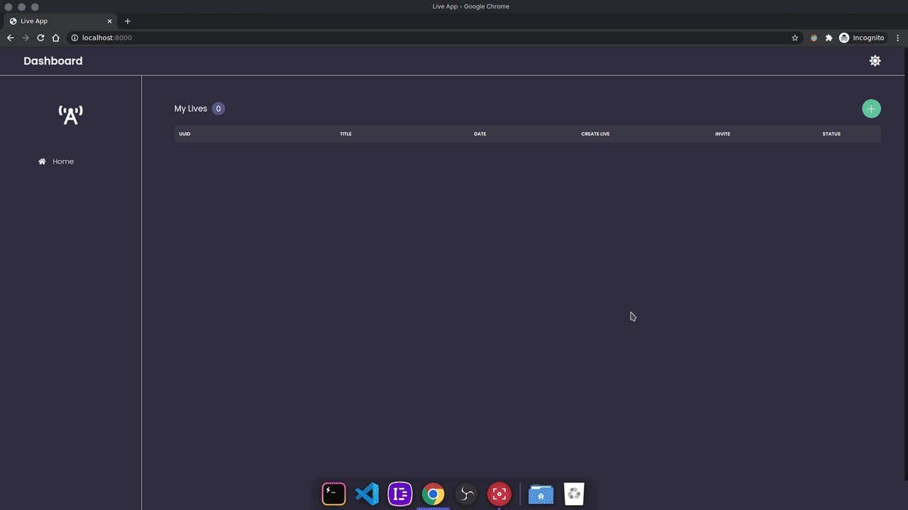

<h1 align="center">
  Microservice live manager
</h1>

## :movie_camera: Preview
<div align="center">
  
</div>

## :memo: Info
  - **Backend**
    - NestJS
      * API REST
      * SocketIO
      * PeerServer
      * PostgreSQL
      * Redis
      * gRPC

  - **Frontend**
    - ReactJS
      * Single Page Application

## :information_source: Getting Started

1. At the terminal, run:

```bash
$ docker-compose up -d
```

2. Open frontend: The host [localhost:8000](http://localhost:8000) and start using it.

## :warning: Warning

If you have a permission error when running the docker, run these commands below to apply the permissions to the file ``.docker/entrypoint.sh``, for windows use [Git Bash](https://gitforwindows.org/).

```bash
/* Only for Unix environment */
$ chmod +x .docker/entrypoint.sh

/* Windows only (works on Git Bash terminal only) */
$ dos2unix .docker/entrypoint.sh 
```
---